# tatatingting.github.io

tingting's blog https://tatatingting.github.io/


## intro

it's source https://github.com/tatatingting/tatatingting.github.io

there're three branches:

- master (published, honored one)
- dev (tools, bugs and cool-jokes)
- gh-pages (not in use anymore, just for fun and remember)


## .gitignore


```
# jekyll site
_site
.sass-cache
.jekyll-metadata
# pycharm
.idea
```


## 0 2 1

### paly with Jekyll, sketch the game

there're topics about Jekyll:

- set up manually and details (v2.3)

- step-by-step local build (v2.0)
- quick-start (v1.1)
- very beginning of local Jekyll (v1.0)
- key points about Jekyll theme


### main refers

quick start of Jekyll / step by step / locall Jekyll

- https://jekyllrb.com/docs/

- https://jekyllrb.com/docs/step-by-step/01-setup/

- https://help.github.com/en/articles/setting-up-your-github-pages-site-locally-with-jekyll

liquid: a new interesting language

- https://jekyllrb.com/docs/liquid/
- https://shopify.github.io/liquid/

deployment, environments, plugins, themes

- https://jekyllrb.com/docs/step-by-step/10-deployment/

- https://jekyllrb.com/docs/themes/


### Part I (v2.1)

- 必须拥有一个 index.html 文件。

- Liquid 可以处理“被朴素传递”的信息：通过上下两排的 `---` 三个短横符号，中间填上：键值对。

  ```
  ---
  # front matter tells Jekyll to process Liquid
  title: Home
  ---
  ```

  

- `_layout` 是模板，其中的 page 指代实例，通过 page.method 调用参数值，通过 content 引用内容。

- `_include` 是 `_layout` 的片段，`_layout` 通过 include 引用。比如：导航部分。

- `_data ` 可以存放 YAML, JSON, CSV 等文件， `_include` 通过 site.data.xxx 引用。比如：遍历导航。

- `assets` 是文件夹，用来放 css, images, js 等文件，`_layout` 通过本地路径引用。比如："link href"。

- sass 是 css 的一个超集，相应的扩展名是  ".scss"。

- `assets/css` 文件夹中有sass文件。 需要组织复杂的css时，可以通过引用 `_sass` 文件夹的内容。

- `_sass` 文件夹也有sass文件。复杂的 css 装饰需要被组织有序，被`assets/css` 引用。

- `_posts` 是放 blogs 的文件夹，里面是 markdown 文件，命名需要参考"2019-07-04-title.md"这个格式。

- blogs 的命名格式，产生了相应的 page.date 和 page.title。

- blogs 可以在文档内再次指定 title，在 page.title 被调用时，文档里的会覆盖文件名提供的。

- blogs 还可以在文档内指定别的东西。 

- blogs 通过语法指定layout，相应的要在 `_layout` 里存在这个模板。比如："post.html"。

- blogs 可以被陈列，比如放在 index.html 里，或者新建一个 blog.html，并手动更新 `_data` 里的导航。


### Part II (v2.2)

- `_config.yml` 是一个全局配置文件，比如：通过 defaults 实现缺省值申明，减少重复工作量。

- 可以在 `_config.yml` 里申明新增 collections 的一个实例 authors，随之新建 `_authors`文件夹。

- `_authors` 文件夹是存放作者信息的，作用类似于 `_post` 文件夹，但里面的markdown文件没有命名格式。

- 就像 posts 需要一个 post.html 专属模板，那么 authors 也可以有一个 author.html 专属模板。

- 就像 posts 需要一个 blog.html 来陈列，那么 authors 也可以有一个 staff.html 来陈列，同时更新导航。

- post 和 author 密不可分，所以两个模板 post.html 和 author.html 之间会发生信息的传递。

- 每一个 post.html 都可能有作者，那就匹配一下，然后把选中的作者变成链接，指向具体的 author。

- 每个 author.html 都可能有博客，那就匹配一下，然后把选出的博客变成链接，指向具体的 post。

```mermaid
graph TD

root
_layouts --- root

_posts --- root
blogs((2019-07-04-title.md)) --- _posts
blogs -."post.html".-> _layouts
blogs ==> blog.html
blog.html --- root

_config.yml --- root
_config.yml -.-> _authors(_authors)

_authors --- root
author((author.md)) --- _authors
author -."author.html".-> _layouts
author ==> staff.html
staff.html --- root

blogs -."the blog's authors".-> author
author -."the author's blogs".-> blogs

```

  



### part III (v2.3)

- prepare for production on GitHub Pages, see https://www.jekyll.com.cn/docs/github-pages/


## LICENSE

- All Rights Reserved. Mostly, as GPL3.0.

- [LICENSE](LICENSE)

