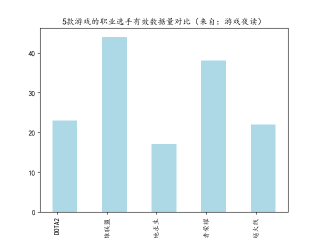
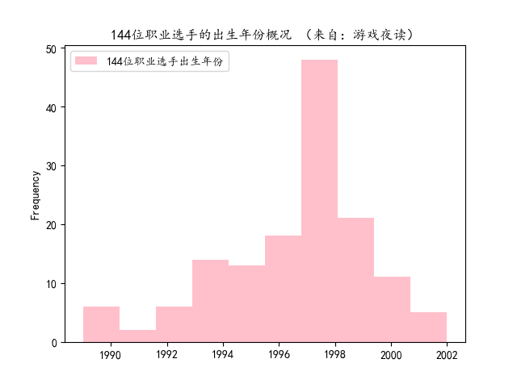
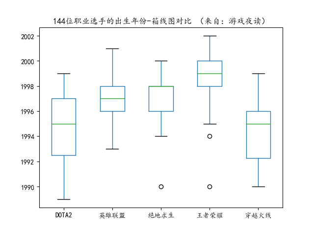
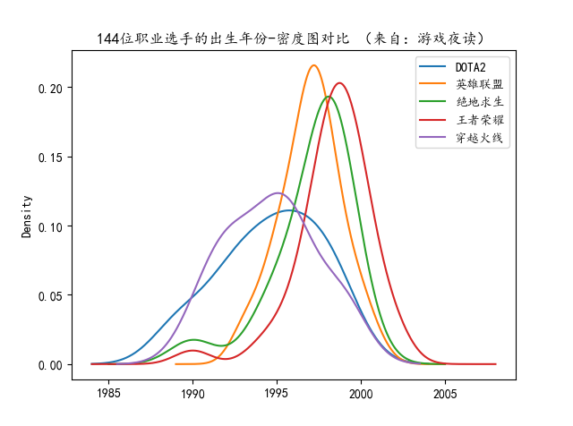

前几天回答了一个问题，题目是“为什么感觉刀塔2的选手比LOL的职业选手要成熟”？当时，不假思索，就答了一通……

#### 关于成熟的理解

所谓成熟，可能是心理上的。因为题主也是用的“感觉”这个词，所以很可能探讨的不是生理年龄的问题。于是从年龄角度的回答就有点片面。

成熟也可能是认知上的。比方说，职业选手的说法，也会有电竞选手的说法，其实指称的同一批人，但由于熟悉度、知识领域、语言习惯，会产生偏差。

但生理年龄确实是一个比较容易获取的统计指标，所以抛开题主的问题。准备收集一下职业选手的年龄数据，稍微对比分析一下，就有了年龄层面的认知。

#### 职业选手的年龄，哪里有？

谁会没事公布自己的年龄？还是贴的网络上一搜就能搜到的那种程度呢？还真的能查到不少电竞选手的出生日期信息啊！电子竞技真在崛起。当然，这些状况可能是由于当年玩游戏的孩子们都步入中青年的自然现象。

只是，按图索骥般搜索信息，效率太低。既然电子竞技有点小热，肯定是要有平台或者团队进行电子竞技选手信息的专业管理的。比如战队、姓名、游戏ID、赛事相关、直播间、梗、个人社交主页等等，甚至于恋爱、癖好。

如果能找到上述的这种平台，大概率会有职业选手的出生日期，就能对电竞选手的年龄进行基础的数据分析了。果然，姜还是老的辣，游久网。

#### 五款热门游戏的职业选手数据

经过一番折腾，拿到了《DOTA2》，《英雄联盟》，《绝地求生》，《王者荣耀》，《穿越火线》这五款游戏关注度较高的职业选手信息，其中个人信息部分就有包括“出生日期”这个关键数据。激动。

因为这里只关注选手的出生日期，对其他信息不关注，所以需要简单说明一下拿到的有效样本。也就是那些有比较明确的出生时间信息的选手。

《DOTA2》拿到了39位选手的信息，其中23份有效。
《英雄联盟》拿到了51份，其中44份有效。
《绝地求生》拿到了41份，其中17份有效。
《王者荣耀》拿到了47份，其中38份有效。
《穿越火线》拿到了37份，其中22份有效。
合计，一共拿到了215位选手的信息，其中144份是有效样本。

应该是一帮有偏样本，但偏在哪里不明确。无效样本提供的大多数是：未知、暂无。是什么原因拿不到这些数据呢？可能是低调，不喜欢曝光。而年纪的大小会不会影响曝光心理，这个可能是另外一个研究课题，不可以轻应作结论的。

另外需要注意的是：数据的错误在所难免。错报、纂改、记录错误、获取失败等等，都会影响数据的准确度，这里只能保证从网络上获取后没有纰漏。

#### 职业选手的年龄数据分析

虽然数据有很多的不确定性，但分析样本总是会有乐趣的。

##### 最大和最小的比较

通过一系列看似简单，实则繁琐的数据处理，终于可以对144位职业选手的出生日期有所认识了！先说其中最早的年份，1989年，一共有2位，均玩着《DOTA2》。其说最晚的2002年，同样也是一共有2位，均玩着《王者荣耀》。其余的140位选手主要分布在90年代，尤其是1995年到2000年这5年间。

其中，五分之一的选手，即有29位职业选手都出生于1998年。在今2019年正值法定结婚年龄附近的21岁。其次是1999年21位，1997年19位，1996年18位。

年龄最大的跟最小的，相差13岁。整体分布上，属相、星座都包圆了。

具体是谁我没有看。

##### 平均年龄的比较

下面计算一些统计量，看一下具体游戏的年龄分布情况。四舍五入。

《DOTA2》跨度11年（1989~1999），涉及10个年份，平均年份值1994.7。
《英雄联盟》跨度9年（1993~2001），涉及9个年份，平均年份值1997.0。
《绝地求生》跨度11年（1990~2000），涉及个8年份，平均年份值1997.1。
《王者荣耀》跨度13年（1990~2002），涉及个10年份，平均年份值1998.4。
《穿越火线》跨度10年（1990~1999），涉及个9年份，平均年份值1994.6。
合计，144位选手跨度14年（1989~2002），平均年份值1996.4。

从拿到的这份数据看，《DOTA2》和《穿越火线》的职业选手们年纪相对大一些。

##### 经典问题：生日在同一天的概率

因为手握144个样本，又是在做出生日期相关的数据分析，那就自然很可能会发现有职业选手是在同一天生日这个现象。

依据经典概率，144份样本中至少有两个人生日在同一天的概率是高达14个9。

##### 那些生日在同一天的职业选手

是时候发现同年同月同日生的职业选手了。一度怀疑是不是数据被记录的时候弄错了。这样有趣的日子一共有3个，每个日子都恰好有2个选手出生。

首先是1996年4月24日，两位同在《穿越火线》的小伙伴都在这一天出生：宠儿（张签）和k（许宏宇）。前者在AG战队，后者在情久战队。

然后是1998年10月24日，两位小伙伴在这一天出生：Lwx（林炜翔）和凉晨（张奇）。前者在《英雄联盟》FPX战队，后者在《王者荣耀》RNG.M战队。

最后是1999年6月7日，两位同在《王者荣耀》Hero战队的小伙伴在这一天出生：久诚（曹志顺）和最初（龙志彪）。

不知道说啥，恭喜，祝大家幸福吧！
