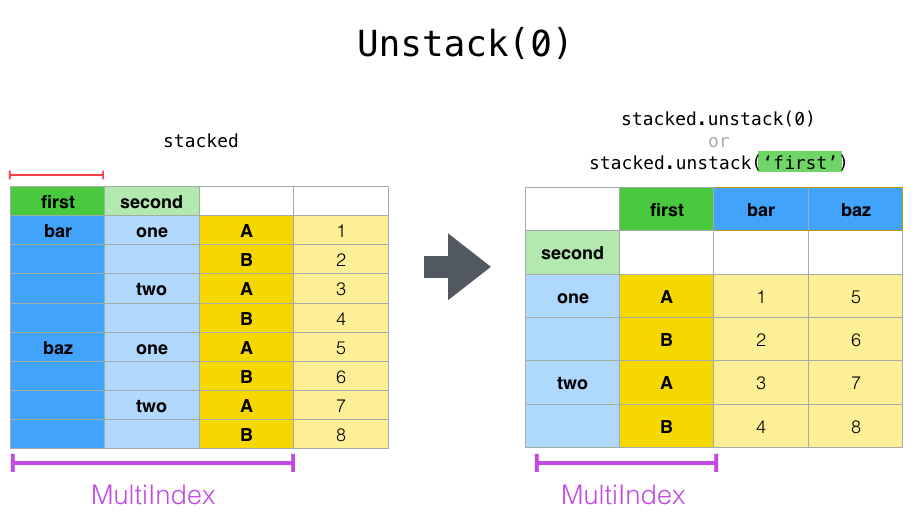

数据处理涉及面比较广，数据清理是一些手段和步骤，整理范围相对更小。基于这个认识，开始聊下面的。

#### 一个模糊的提问

整理数据的时候遇到困难，往往是针对现有的数据结构不满。比如常见的三种期望：每种统计量是一列，每次观测值是一行，每一类实验数据单独一个表。

实际遇到的数据，往往不够理想。

这个时候能力不足无法解决，或者虽然有了笨办法，但又想知道更高效、实用的，怎么办呢？

肯定是搜索和提问。

难就难在不知道怎么描述。可能七七八八说了个大概，总体上还是一个模糊的提问。

#### 行列变换，reshape(重塑)

常见的用词是“行列变换”。

说起行列变换，可能说中了大部分的数据整理问题！只是因为行列变换这四个字，模模糊糊地描述出了可能的解决办法。

但实际上，这个数据整理的难题，跟线性方程组、矩阵、行列式的初等变换不太一样。

另一个说到点子上的词是 reshape 重组。

说起reshape，可能第一个反应是 numpy.reshape ，其常见的应用如下所示了。但这里要说的不是这个。而是pandas官方文档里的图例。对应的操作，在R语言也比较成熟。

```
>>> a = np.arange(6).reshape((3, 2))
>>> a
array([[0, 1],
       [2, 3],
       [4, 5]])
```

#### 数据整理的难题：reshape 重组

数据重组(reshape)就是对数据的统计结构进行变换，枚举的变成计数的，分类的改成变量。

部分效果跟Excel透视表是差不多的。这类问题在pandas的官方文档里也有专题，还有有一个统称，叫“数据重塑和透视表”。

英文是 Reshaping and Pivot Tables。一共介绍了重塑数据框的三大类方法：透视pivot，堆叠stack和平铺unstack，熔化melt。

首先是透视(pivot)。透视是指小而美的个性化重组。需要提前设定好需要的横向标签index、纵向标签column、被观察的数据value。


然后是堆叠(stack)和平铺(unstack)。堆叠是“横向变成纵向标签”，往垂直方向堆叠。平铺是“纵向标签变成横向”，往水平方向平铺。


堆叠和平铺都是指简单粗暴的索引重组。只需要执行命令即可，优点是“矫揉造作”：伸缩自如，循环往复。


其中，平铺unstack可以指定把现有的哪一个层级拉出来溜溜，只需要通过一个参数确定。默认情况下，就是对最末尾的那个索引下手。




最后是熔化(melt)。先熔化(melt)已待利用。操作也非常简单粗暴，就是完全打散，退化成“键值对”形式的重组。

兼具解释性强和便利性的优点。解释性强指的是能直白感受到信息的完全保留。便利性体现在保留了拒绝打散的权力。


#### 数据整理的经典论文《Tidy Data》。

绝大部分的R使用者，大部分的数据处理工作者，应该都有机会接触到这篇论文。可能是直接看论文中的例子，也可能是通过转了几手的笔记间接习得。如果早些年阅读过这篇论文，那在提问的时候，可能带上一些模糊的印象。

但如果没有这些储备的知识呢？当遇到此类数据整理的问题时，该如何表达自我？该如何描述问题？一个实用的提问方法是：找到一个相对活跃的论坛，然后把具体的现状、期待的状态摆出来。

有不少的教材、笔记，是翻译过来的。早前还出现过“数据整容”这样词，现在几乎搜不到了。

这篇论文现在是开放下载的。

>Authors:	Hadley Wickham
Title:	Tidy Data
Abstract:	A huge amount of effort is spent cleaning data to get it ready for analysis, but there has been little research on how to make data cleaning as easy and effective as possible. This paper tackles a small, but important, component of data cleaning: data tidying. Tidy datasets are easy to manipulate, model and visualize, and have a specific structure: each variable is a column, each observation is a row, and each type of observational unit is a table. This framework makes it easy to tidy messy datasets because only a small set of tools are needed to deal with a wide range of un-tidy datasets. This structure also makes it easier to develop tidy tools for data analysis, tools that both input and output tidy datasets. The advantages of a consistent data structure and matching tools are demonstrated with a case study free from mundane data manipulation chores.
Submitted: 2013-02-20. Published: 2014-09-12.
https://www.jstatsoft.org/article/view/v059i10
