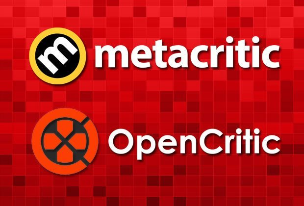

OpenCritic和Metacritic是两个在世界范围内影响较深远的娱乐作品类评论网站，尤其是电子游戏。

其影响力主要在两个方面。一方面向全球地区的玩家和评测人员。另一方面则是面向全球的游戏发布、评测发布等游戏平台。尤其是后者。例如：游民星空作为中国单机游戏门户网站，于2018年1月发表一篇题为《游民星空的游戏评测已被OpenCritic正式收录》的新闻。再比如：《每日星报(Daily Star)》是英国的一份著名报纸，也有其同名网站和游戏版面，于2019年4月发表一篇题为《每日星报的游戏评测已被OpenCritic和Metacritic正是收录(Daily Star Gaming joins OpenCritic and Metacritic)》的新闻。足可见这两大世界游戏评论阵地的影响力之大了。

#### OpenCritic的公益和开放

OpenCritic有四位创始人，分别是马修·恩托温，查理斯·格林，亚伦·拉特利奇，理查德·特里格斯(Matthew Enthoven, Charles Green, Aaron Rutledge, and Richard Triggs)。他们一直保持着网站非营利的状态，日常的服务器开销、运营成本主要靠众筹、捐赠来维持，所以官网最底下有个专门致谢的传送门。网站地址是www.opencritic.com，整体风格简洁、高效，分类检索最早能查到2013年。

关于网站的初衷，四位创始人表示想建立一个真正庆祝游戏的阵地，以此推动游戏行业积极的变化。他们认为自己富有“幼稚”的乐观主义精神，希望通过这个网站，汇聚开发者、评论家、游戏玩家。在OpenCritic的众筹页面还有其他的介绍，包括他们自身的背景、网站的规划、收入的用途等。

OpenCritic的创始人是游戏玩家和开发者。顺便还提到了《魔兽世界》最经典的BOSS战之一“巫妖王之冰封王座(The Lich King)”，“召唤师峡谷(Summoner's Rift)”，《命运》的主线结尾任务Raid之一“玻璃宝藏(Vault of Glass)”，《辐射4》的那块“波士顿荒地(Boston wasteland)”，上古卷轴，《星际争霸2：虚空之遗》中的艾尔母星(fields of Aiur)，还把《沙漠2(Dust2)》称为“海市蜃楼”。他们还一起建设WoW公会的网站、自动招募，用作娱乐的大菠萝3机器人(Diablo 3 bots)，还有英雄联盟(League of Legends)相关的。

#### Metacritic的红黄绿和被收购

Metacritic有三位创始人，此前都是律师职业。主要涉及电影、电子游戏。网站网址是www.metacritic.com，整体风格明快、丰富。分类检索最早能查到1995年。不过，该年只查到一个作品。

关于网站的初衷，三位创始人的想法形成于1999年，他们希望能给众多的娱乐产品进行一个综合打分，这样用户就能更合理的消费，并更好地提前安排自己的娱乐时间，网站于2001年1月正式推出，快速发展几年后，2005年被CNET收购。

Metacritic的特色是它特有的加权平均打分系统得出的综合评分：metascore。好的评价显示为绿色，中等的是黄色，差劲显示的是红色。综合评分主要来自两个方面的考量，一方面是用户的反馈，另一方面是经过挑选的评论员和评测网站。
