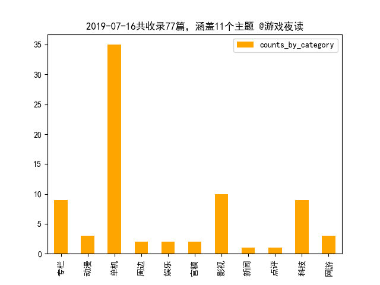

Hi, morning! What did I do yesterday? What will I do today? Are there any impediments in your way?

Here is the "Game Daily" - a reference to the game. Produced by game1night, Tingbot is responsible for editing and publishing, looking forward to better performance. 早上好，这里是「游戏日报」——收录有关游戏的参考资料。由game1night出品，Tingbot负责编辑和发布，期待更好的表现。

#### Overview 概述

本期共收录77篇，涉及11个主题，包括：单机（35），影视（10），科技（9），专栏（9），网游（3），动漫（3），官稿（2），娱乐（2），周边（2），点评（1），新闻（1），信息来源：游民星空。

#### Key words 关键词

本期关键词top50：游戏，视频，10，2019，Steam，无主之地，发售，任天堂，玩家，今日，公布，制作，一款，正式，展示，DLC，Gearbox，iPhone，RNG，官方，英雄，小霸王，制版，平台，全新，测试，推出，影院，方向盘，忍者神龟，赛博，跨平台，发布，一段，朋克，纹章，手机，上线，互动，他们，媒体，一张，40，Jennika，CDPR，2077，She，Xbox，育碧，本作。

#### Summary 摘要

以下是目录：

##### [专栏 | 吃鸡游戏直播热度大跌 玩家也不知道该看啥了](https://www.gamersky.com/zl/201907/1203784.shtml) 

据统计数据，刚刚过去的第二季度，《绝地逃生》《堡垒之夜》《Apex 英雄》等几款头部吃鸡作品的直播热度在Twitch、Youtube 、等国际…

##### [专栏 | 士兵连开三枪就要进医院！放大版毛瑟98K专削坦克](https://www.gamersky.com/zl/201907/1203854.shtml) 

1916年9月15日，索姆河战役已经整整打了两个多月，英法联军虽然在正面进攻上节节胜利，但是也付出了惨重的代价，损失了二十万人以上…

##### [专栏 | 复古游戏《炽热合金》：一封写给魂斗罗的情书](https://www.gamersky.com/zl/201907/1203738.shtml) 

2019 年 7 月中旬上线的这款《炽热合金(Blazing Chrome)》就是一款典型的向 魂斗罗经典系列致敬的作品。在玩过之后，赞不绝口啊。

##### [专栏 | 弹幕里做选择 在二次元视频网站里玩“页游”](https://www.gamersky.com/zl/201907/1203847.shtml) 

B站前段时间新推出了视频类别——「互动视频」。顾名思义，拥有互动功能的视频，允许我们在看视频的同时，通过选项和视频互动，从而…

##### [专栏 | 总是被吐槽的Steam推荐系统这次终于有救了？](https://www.gamersky.com/zl/201907/1203882.shtml) 

Steam 刚刚结束了一个让自己有点难堪的夏日特卖主题活动「汽车大奖赛」，但没过几天就在首页的同一个位置悄然上线了另一个名为「Ste…

##### [专栏 | 游艺市场的怪诞：头部企业仅有5亿的市场份额](https://www.gamersky.com/zl/201907/1203781.shtml) 

在中国游戏市场，相比于火热的移动游戏，游戏游艺产业却甚少受游戏业界所关注。在《2017年中国游戏行业发展报告》中，中国游戏游艺…

##### [专栏 | 自走棋产品大战 原来是一场“拼爹游戏”](https://www.gamersky.com/zl/201907/1203875.shtml) 

经过了一段时间的蛰伏之后，各大国内外厂商们正式拉开了自走棋市场乱战的帷幕。随着《云顶之弈》、《刀塔霸业》等游戏的相继上线，…

##### [专栏 | 视频|胶佬必备的工具水口钳 越贵就越好吗？](https://www.gamersky.com/zl/201907/1203456.shtml) 

本期视频介绍了胶佬必备的工具水口钳，给大家展示了一些品牌的使用对比，来看看究竟哪款更合适自己。

##### [专栏 | 视频|高达40周年企划 居然还有未公布的内容！？](https://www.gamersky.com/zl/201907/1203821.shtml) 

一起来看看，在高达40周年之际，OPPO与高达联名推出的这款周边给了我们一个惊喜！！！

##### [动漫 | 《一拳超人》漫画最新话：黑精不可小觑 僵尸男危机](http://acg.gamersky.com/news/201907/1203597.shtml) 

《一拳超人》重制版漫画153、154话都已经更新了，这两话都是S级英雄和实力超强的怪人之间的战斗，连在一起看更有感觉。

##### [动漫 | 《忍者神龟》加入女性“忍者神龟”！原本是人类](http://acg.gamersky.com/news/201907/1203561.shtml) 

IDW在最新漫画中公布了一名新的忍者神龟——Jennika，Jennika是一位女性忍者神龟，戴着黄色面具，武器有利爪、剑和弓，由TMNT设计师…

##### [动漫 | 动画《肌肉少女》开播福利满满 日本阿宅跟风健身](http://acg.gamersky.com/news/201907/1203626.shtml) 

日本7月新番《肌肉少女：哑铃，能举多少公斤？》开播后意外引发了一场阿宅之间的锻炼风潮：打开房门走向健身房。

##### [单机 | CDPR官方解释《2077》出身设定：人以类聚物以群分](https://www.gamersky.com/news/201907/1203599.shtml) 

CDPR官方又带来了一段短视频，为我们简单介绍了《赛博朋克2077》中人物的出身设定，以及它会怎样对游戏中的选择造成影响。

##### [单机 | CDPR重申《2077》是RPG 角色可能会对改造上瘾](https://www.gamersky.com/news/201907/1203629.shtml) 

CDPR重申《赛博朋克2077》是RPG，玩家们的角色根据身上安装的增强物品数量不同，可能会对改造上瘾。

##### [单机 | Steam上这款交互惊悚游戏更新简中 好评率76%](https://www.gamersky.com/news/201907/1203533.shtml) 

交互惊悚游戏《She Sees Red》今日发布公告，更新了中文（简体）字幕。

##### [单机 | Xbox开启游戏促销：《地平线4》5折、《全境2》6折](https://www.gamersky.com/news/201907/1203883.shtml) 

Xbox超级游戏促销现已开启，包括《狂怒2》、《FIFA19》、《荒野大镖客：救赎2》在内超过上百款游戏。

##### [单机 | 《COD16》东西部有两个超级阵营 下面还有小弟派系](https://www.gamersky.com/news/201907/1203733.shtml) 

根据IW工作室艺术总监Joel Emslie的回应，确认多人游戏中会存在两个“超级阵营”，而在他们之下还会有“子派系”。

##### [单机 | 《NBA 2K20》前20球星数值：洛杉矶坐拥两位第一人](https://www.gamersky.com/news/201907/1203534.shtml) 

《NBA 2K20》正式公布了游戏中顶级球星们的能力数值，其中洛杉矶湖人队球星勒布朗·詹姆斯与快船队的科怀·伦纳德以97的能力值并列…

##### [单机 | 《三国：全战》新DLC“八王之乱”公布 8月8日发售](https://www.gamersky.com/news/201907/1203926.shtml) 

《三国：全面战争》今日公布了首个章节DLC“八王之乱”，将于2019年8月8日发售，预购可享受10%折扣优惠，原价40元，现优惠价36元。

##### [单机 | 《三国：全战》新补丁：修复二五仔关羽、骗婚赚钱](https://www.gamersky.com/news/201907/1203899.shtml) 

《三国：全面战争》今日发布了1.1.1测试更新，包括修复了关羽和张飞不会再背叛他们的结义兄弟刘备，以及关羽不会背叛任何人，玩家无…

##### [单机 | 《刺客奥德赛》DLC终章预告公布 今天已正式解锁](https://www.gamersky.com/news/201907/1203746.shtml) 

育碧官方公布了《刺客信条：奥德赛》的DLC“亚特兰蒂斯之命运”第三章节的新预告。

##### [单机 | 《实况2020》独家签约尤文图斯 C罗、内德维德亮相](https://www.gamersky.com/news/201907/1203805.shtml) 

《实况足球2020》官方宣布独家签约意大利足球俱乐部尤文图斯，并带来了预告片。

##### [单机 | 《底特律》等开发者：云通关让我们的游戏卖得更好](https://www.gamersky.com/news/201907/1203632.shtml) 

在近期的Gamelab中，《逃出生天》、《底特律：变人》的创意总监Josef Fares和David Cage在演讲中表示：不仅没有对销量产生危害，而…

##### [单机 | 《战神》艺术总监绘《茶杯头》Boss 写实恶魔夺你魂](https://www.gamersky.com/news/201907/1203660.shtml) 

《战神》的艺术总监Raf Grassetti为《茶杯头》中的两位BOSS“骰子王”和“恶魔”绘制了两幅风格差异巨大的艺术画。

##### [单机 | 《无主3》武器超十亿射到手软 枪自己跑还会生小枪](https://www.gamersky.com/news/201907/1203511.shtml) 

2K发行Gearbox打造的射爆大作《无主之地3》曝光最新情报，我们已经知道本作拥有的枪支武器数量超过数十亿，其中有些枪会自己跑自己…

##### [单机 | 《无主之地3》全新预告发布 秘藏猎人激情蹦迪超嗨](https://www.gamersky.com/news/201907/1203894.shtml) 

在今天的“Celebration of Togetherness”庆典活动上，Gearbox发布了《无主之地3》全新预告，一起来欣赏一段超嗨的大型蹦迪现场。

##### [单机 | 《无主之地3》发售时无法跨平台联机 会在未来加入](https://www.gamersky.com/news/201907/1203541.shtml) 

开发商Gearbox的CEO Randy Pitchford今日在推特证实了《无主之地3》在发售时没有跨平台联机功能，不过他承诺之后会努力支持该功能。

##### [单机 | 《最终幻想7重制》发布新概念图 展示米德加一号街](https://www.gamersky.com/news/201907/1203928.shtml) 

《最终幻想7：重制版》官方推特今日发布了一张概念艺术图和一张游戏截图，展示了游戏中的米德加一号街。

##### [单机 | 《植物大战僵尸》新作即将测试 或是《花园战争3》](https://www.gamersky.com/news/201907/1203665.shtml) 

《植物大战僵尸》射击游戏新作开启封闭测试，或许是《花园战争3》

##### [单机 | 《海岛大亨6》PS4/XB1版9月27日发售 已推出试玩版](https://www.gamersky.com/news/201907/1203922.shtml) 

发行商Kalypso Media和开发商Limbic Entertainment今日宣布，《海岛大亨6》将于9月27日在登陆PS4和Xbox One平台。

##### [单机 | 《火纹风花雪月》全职业攻击动画演示 必杀技超帅气](https://www.gamersky.com/news/201907/1203878.shtml) 

IGN公布了一段《火焰纹章：风花雪月》的各职业/兵种通常攻击动画的演示，其中也展示了他们能够使用的武器。

##### [单机 | 《火纹：风花雪月》新预告 金鹿学级、烹饪系统展示](https://www.gamersky.com/news/201907/1203636.shtml) 

任天堂公布《火焰纹章：风花雪月》的新视频，展示了金鹿学级和游戏中的烹饪系统。

##### [单机 | 《红警重制版》公布磁暴坦克示意图 配件细节超丰富](https://www.gamersky.com/news/201907/1203608.shtml) 

EA制作人Jim Vessella公布了《命令与征服：红色警戒 重制版》的制作进度以及一张磁暴坦克的示意图。

##### [单机 | 《莱莎的炼金工房》公布OP 神田沙也加献唱主题曲](https://www.gamersky.com/news/201907/1203888.shtml) 

预定2019年9月26日（四）发售的PlayStation4/Nintendo Switch用游戏《莱莎的炼金工房 ～常暗女王与秘密藏身处～》（Steam预定10月29…

##### [单机 | 《血源》主题T恤4500日元/件 鸟姐、噩梦之主穿上身](https://www.gamersky.com/news/201907/1203811.shtml) 

TORCH TORCH将联动《血源》推出主题T恤，总共8种花色。

##### [单机 | 《赤痕》发布DLC调查问卷 你喜欢女仆还是魔法少女](https://www.gamersky.com/news/201907/1203731.shtml) 

《赤痕：夜之仪式》开启了一项问卷调查，准备在13个免费DLC外推出一些额外的付费内容。

##### [单机 | 《鬼泣5》星战MOD V化身凯洛伦、光剑处决更帅气](https://www.gamersky.com/news/201907/1203717.shtml) 

Nexus的制作者Nxus64为《鬼泣5》的V制作了一个《星球大战：原力觉醒》中的凯洛·伦套装和光剑MOD。

##### [单机 | 为吸引老任回归 巴西玩家举办民间“任天堂直面会”](https://www.gamersky.com/news/201907/1203740.shtml) 

在巴西，10多个小时之后会有一场特殊的任天堂直面会，这场直面会的举办人并不是任天堂的官方人员，目的却是为了引起任天堂的注意。

##### [单机 | 国产模拟打工游戏上架Steam 深圳送外卖逐梦都市](https://www.gamersky.com/news/201907/1203778.shtml) 

最近，Steam商店上架了一款名为《白石洲往事》的国产游戏，本作是一款“模拟打工”类型的开放世界游戏。

##### [单机 | 日本游戏厅太鼓达人鼓面频频被盗 作案者均是高中生](https://www.gamersky.com/news/201907/1203757.shtml) 

据日经新闻报道，日本各地游戏中心的《太鼓达人》部件频频被盗，而盗窃者作案动机竟然是偷容易得高分的太鼓鼓面进行练习。

##### [单机 | 晨报：LOL源计划皮肤预览 无主3发售时无跨平台联机](https://www.gamersky.com/news/201907/1203529.shtml) 

《英雄联盟》2019源计划皮肤预览及原画，《无主之地3》发售时没有跨平台联机，乔治·马丁：《权力的游戏》粉丝的反应不会改变小说结…

##### [单机 | 杉果上架《无主3》等3款Epic独占游戏 更有独家优惠](https://www.gamersky.com/news/201907/1203791.shtml) 

继Steam、Uplay、Bnet等平台后，国内零售商杉果又上架了三款Epic平台独占游戏《无主之地3》《天外世界》和《先祖：人类奥德赛》。

##### [单机 | 玩家打造《马里奥制造2》魔鬼关卡 难度堪称变态级](https://www.gamersky.com/news/201907/1203704.shtml) 

最近油管一位UP主YTSunny上传了自己制作的“魔鬼关卡”视频，看了简直让人目瞪口呆。

##### [单机 | 网易游戏宣布收购《黎明杀机》开发商少数股份](https://www.gamersky.com/news/201907/1203558.shtml) 

网易游戏宣布，他们收购了加拿大独立游戏厂商Behaviour Interactive的少数股份，而后者也是《黎明杀机》游戏的开发商，此前网易旗下…

##### [单机 | 育碧回应批评：《看门狗3》有官方作曲 活动靠自愿](https://www.gamersky.com/news/201907/1203594.shtml) 

育碧对此《看门狗：军团》的创作批评行了回应，表示开发团队目前已经在和专业艺术家合作进行游戏内音乐的授权和创作。

##### [单机 | 这款电影风跳台游戏将在Steam发售 内含超多小游戏](https://www.gamersky.com/news/201907/1203776.shtml) 

《Horace》是一款怀旧电影风格跳台动作游戏，将于7月18日在Steam平台正式发售，这款复古风格的像素游戏由两位开发者花费了七年的时…

##### [单机 | 速通大神刷新《塞尔达时之笛》纪录 用时不到17分钟](https://www.gamersky.com/news/201907/1203919.shtml) 

速通玩家Torje Amundsen近日创造了《塞尔达传说：时之笛》的新速通记录，把时间缩短到了16分58秒，他也是首位突破17分钟的速通玩家。

##### [周边 | “夜猫族”有了新去处 上海首批24小时影院上线](https://www.gamersky.com/news/201907/1203806.shtml) 

“24小时影院”可理解为“跨零点影院”，平常电影排映最后一场一般在晚上11时许，而“24小时影院”的排映场次将延迟至零点后。

##### [周边 | 开天工作室首款火影对战雕像：八门夜凯怒踢六道斑](https://www.gamersky.com/news/201907/1203906.shtml) 

开天首款火影“对战”系列：八门凯VS六道斑正式公布，限时5天，国内体数上限588体，官价格6080元。

##### [娱乐 | 今日快乐源泉：大家一起来同步 猫咪是大赢家](https://www.gamersky.com/ent/201907/1203647.shtml) 

很多时候，小宠物们在看到各种人类的动作都会想要模仿，加上本身就很可爱，大多数的时候效果真是出奇的好。

##### [娱乐 | 软萌Q弹的肉感身材 犹如棉花糖般的白嫩樱花妹](https://www.gamersky.com/ent/201907/1200193.shtml) 

nan

##### [官稿 | 3D舰姬即时海战手游《苍蓝誓约》指挥官视频攻略](http://shouyou.gamersky.com/news/201907/1203612.shtml) 

《苍蓝誓约》一款3D舰姬即时海战手游，游戏充满了紧张刺激充满竞技性。话不多说，下面让我们来看看实战体验究竟如何。

##### [官稿 | 天刀手游首测定档7月23日 NPC攻略系统PV发布](http://shouyou.gamersky.com/news/201907/1203542.shtml) 

心动一刻、共赴天涯！作为腾讯旗舰之作，《天涯明月刀》手游自问世以来就备受关注。

##### [影视 | 《女超人》第5季曝超女新造型 黑丝超短裙变紧身裤](https://www.gamersky.com/news/201907/1203537.shtml) 

梅利莎·拜诺伊斯特主演的CW剧《女超人》即将在今年10月迎来第五季，在新一季中超女会换上全新装扮，裙子变裤子。

##### [影视 | 《沙赞》男主：续集巨石强森“黑亚当”仍将缺席](https://www.gamersky.com/news/201907/1203825.shtml) 

沙赞本赞扎克瑞·莱维近日证实两人不会在续集合体，“毕竟他们的想法是先拍摄《黑亚当》独立电影。”

##### [影视 | 《终结者6》初代女战神剧照曝光 同框辣妹气场全开](https://www.gamersky.com/news/201907/1203695.shtml) 

《终结者6》新剧照曝光，初代女主琳达·汉密尔顿饰演的莎拉·康纳，以及两位新女性角色现身，这次She is back。

##### [影视 | 乔治马丁：《权游》粉丝的反应不会改变小说结局](https://www.gamersky.com/news/201907/1203569.shtml) 

虽然广大剧迷对《权力的游戏》最终季结局十分不满，不过原著作者乔治·R·R·马丁表示，无论观众们对电视剧的反应如何、给予正面或…

##### [影视 | 刘德华《扫毒2》票房破10亿 除了《狮子王》无敌手](https://www.gamersky.com/news/201907/1203691.shtml) 

由刘德华、古天乐、苗侨伟主演的动作片《扫毒2》在上映12天后，票房正式破10亿，加入10亿票房俱乐部。

##### [影视 | 周星驰已婚？助理回应：假的！微博发文反击](https://www.gamersky.com/news/201907/1203671.shtml) 

对个别媒体爆料说周星驰已婚的消息，周星驰助理陈震宇回复道：“假的，希望个别媒体别再博眼球蹭热度！”

##### [影视 | 国产动画《武圣关公》宣布撤档：因为制作进度原因](https://www.gamersky.com/news/201907/1203684.shtml) 

国产动画电影《武圣关公》今日宣布撤档，该片原定于7月26日上映。

##### [影视 | 大超晒《巫师》美剧新剧照 杰洛特骑爱马萝卜登场](https://www.gamersky.com/news/201907/1203924.shtml) 

亨利·卡维尔今日在Ins上分享了一张《巫师》美剧的新剧照，杰洛特骑着爱马萝卜登场，杰洛特脸上沾上了不少泥土，看起来风尘仆仆，估…

##### [影视 | 漫威推出1：1美国队长盾牌 售价100美元](https://www.gamersky.com/news/201907/1203743.shtml) 

漫威选择和孩之宝合作，推出1：1美国队长盾牌，直径大概60cm，预计今年10月发售。

##### [影视 | 糖哥：《绿箭侠》最后一季太过精彩 今晚不用睡了](https://www.gamersky.com/news/201907/1203772.shtml) 

这位演员在推上说他睡不着觉，因为《绿箭侠》的工作就是这么酷。

##### [新闻 | 游民玩家DIY最便宜方向盘：水管、锁头打造](https://www.gamersky.com/news/201907/1203634.shtml) 

亲测玩欧卡2杠杠地，把游戏里鼠标灵敏度调最小，方向盘刚好和游戏里方向盘同步，玩LFS都有不错的感觉，不过本方向盘只能玩有用鼠标…

##### [点评 | 全新《梦想世界》全国争霸赛评测：一场全民PK盛会](https://www.gamersky.com/review/201907/1203585.shtml) 

作为一场全民性的无差别PK赛事，全新《梦想世界》2019全国争霸赛采用全新3V3自由组队机制，凸显团队协作的乐趣。

##### [科技 | iPhone6停产！全球狂卖2.5亿部 退出历史舞台](https://www.gamersky.com/tech/201907/1203668.shtml) 

随着印度市场iPhone入门机的调整，iPhone 6这一代手机正式退出历史舞台，早在几个月前，全球主要市场上iPhone 6手机就不再开卖了。

##### [科技 | 三星SK海力士试用中国进口材料 减少对日本依赖](https://www.gamersky.com/tech/201907/1203730.shtml) 

此前有分析称日韩这次围绕半导体、面板材料的争议有可能让中国公司获益，这事也不是没可能，据韩媒报道三星、SK海力士已经开始测试…

##### [科技 | 低温无液态水？科学家或找到移民火星“解决方案”](https://www.gamersky.com/tech/201907/1203642.shtml) 

一个国际科学家团队建议使用气凝胶，可以使火星地表变暖，从而可以支持生命并融化结冰的水，或能成为移民火星的“解决方案”。

##### [科技 | 全球首发！ROG游戏手机2搭载骁龙855+ 腾讯游戏定制](https://www.gamersky.com/tech/201907/1203615.shtml) 

在处理器上，ROG游戏手机2更是装填凶猛实力，作为全球首款搭载高通骁龙855 Plus移动平台的游戏手机，是玩家纵横驰骋游戏战场最强有…

##### [科技 | 印尼父母给孩子取名谷歌 还收到了来自谷歌的大礼包](https://www.gamersky.com/tech/201907/1203807.shtml) 

据《雅加达邮报》报道，印尼一对父母Ella Karina和Andi Cahya Saputra给他们的儿子取名为“Google”，谷歌还向他们送去了礼物。

##### [科技 | 小霸王被曝欠薪、拖欠供应商货款 游戏机项目难交接](https://www.gamersky.com/tech/201907/1203652.shtml) 

据最新消息，小霸王公司又陷入了欠薪风波，媒体曝出作为总公司的广东小霸王如意文化科技有限公司给中山市小霸王领先科技有限公司上…

##### [科技 | 疯狂科学家又造黑洞了！存活30飞秒后爆炸](https://www.gamersky.com/tech/201907/1203528.shtml) 

全球功率最大的X射线机就在两周前创造了一个分子大小的“黑洞”。

##### [科技 | 知名色情网站4名骨干落网 贩卖邀请码获利40余万](https://www.gamersky.com/tech/201907/1203666.shtml) 

四名犯罪嫌疑人因非法利用信息网络、制作、传播淫秽物品被提起公诉，目前已经进入量刑阶段。

##### [科技 | 苹果新笔记本竟暗中缩水 固态硬盘读取速度骤降35％](https://www.gamersky.com/tech/201907/1203921.shtml) 

法国媒体Consomac测试了最新款MacBook Air 256GB后发现，SSD固态盘虽然看起来没变，但是速度降低了，读取大幅降低了35％。

##### [网游 | RNG战队打野选手MLXG宣布退役 天高海阔后会有期](https://ol.gamersky.com/news/201907/1203727.shtml) 

RNG电子竞技俱乐部今日发布《RNG战队英雄联盟分部人员变动公告》，即日起，RNG-Mlxg（刘世宇）正式退役，并发布了一段28分钟的退役…

##### [网游 | 《Dota2》Ti9选手年龄出炉：最小18岁 “最老”29岁](https://ol.gamersky.com/news/201907/1203670.shtml) 

fireattack整理了《Dota2》Ti9所有选手的出生日期（未公开除外），并制作了平均年龄表。

##### [网游 | 《LOL》新源计划皮肤演示、原画 至臻艾瑞莉娅酷炫](https://ol.gamersky.com/news/201907/1203530.shtml) 

视频展示了金克丝，艾瑞莉娅，沃里克，阿卡丽，派克五位英雄部分技能和回城动作，未来科技风技能特效超酷炫。

