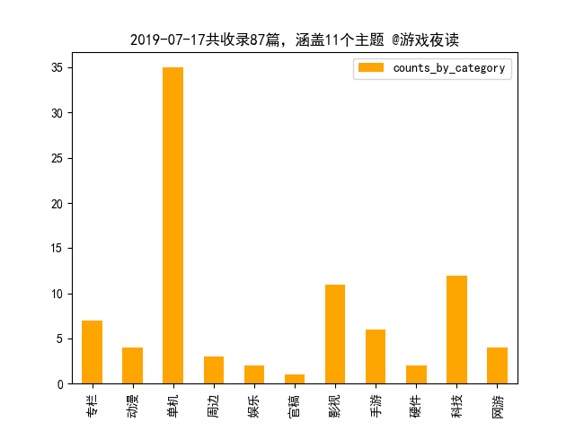

---
title: "游戏夜读-2019-07-18"
categories: game daily
author: tingbot

---

Hi, morning! Here's Ting's Game Daily. What did I do yesterday? What will I do today? Are there any impediments in your way?

### Overview 概述

本期共收录87篇，涉及11个主题：单机（35），科技（12），影视（11），专栏（7），手游（6），网游（4），动漫（4），周边（3），硬件（2），娱乐（2），官稿（1），信息来源：游民星空。

### Key words 关键词

游戏，公布，玩家，任天堂，17，发售，生化危机，今日，Switch，10，预告，近日，一段，今天，官方，2019，推出，电影，网速，今年，赛季，宣布，演示，正式，全新，点映，16，IGN，PC，DLC，15，育碧，微博，手游，实机，2020，预告片，角色，登陆，制作，守望，雷神，平台，开启，最新，日本，新作，展示，一个，手办。

### Summary 摘要

#### [专栏 | 5款有趣的解谜游戏 送给喜欢推理的你](https://www.gamersky.com/zl/201907/1204260.shtml) 

除了《逆转裁判》外，还有不少值得一玩的推理游戏，不过大多数都因为语言问题而鲜少被中国玩家们涉足。借着《逆转裁判》的东风，推…

#### [专栏 | 《哪吒之魔童降世》颠覆而来 会是暑期档票房冠军吗](https://www.gamersky.com/zl/201907/1204185.shtml) 

今年暑假，《哪吒之魔童降世》在上映前半个月开启了点映。在国产动画电影市场，点映是营造口碑的重要方式，点映期间的观众口碑将一…

#### [专栏 | 上海龙夺冠了，我们需要在意它的韩国人班底吗？](https://www.gamersky.com/zl/column/201907/1204210.shtml) 

中国战队终于拿到了OWL的第一个冠军，但是放眼一看，上场的队员竟然没有一个中国人。

#### [专栏 | 什么使游戏变得不完整？细数NS内容被删减的游戏](https://www.gamersky.com/zl/201907/1204196.shtml) 

Switch为任天堂挽回了WiiU失力的局势，但是每个作品都作出了不同程度上的内容删减，今天我们就来看看那些我们喜欢的作品都删减了什…

#### [专栏 | 型月史上最具争议的角色 金闪闪真是“混沌善”？](https://www.gamersky.com/zl/201907/1204158.shtml) 

型月世界中的争议性人物，并不在少数。许多高存在感的角色，基本都是粉黑参半。今天本文的主角，则是其中最具争议性的一个。

#### [专栏 | 没买到Ti9门票就自己组队伍打进去！Monet励志之路](https://www.gamersky.com/zl/201907/1204221.shtml) 

2019年5月24日下午，数十万中国Dota2玩家涌进大麦网，他们誓要用出冲分时的拼劲，攻克一场重要的“比赛”——抢购Ti9门票。而这些抢…

#### [专栏 | 育碧招募粉丝为游戏配乐惹怒网友？该不该无偿使用](https://www.gamersky.com/zl/201907/1204202.shtml) 

当你特别喜欢一个游戏的时候，你肯定有想过这么一个问题：「如果我的一些想法和创作能被游戏团队认可和采纳就好了。」

#### [动漫 | Netflix《弥留之国的爱丽丝》真人剧 残酷生存战](http://acg.gamersky.com/news/201907/1203982.shtml) 

Netflix宣布将推出《弥留之国的爱丽丝》的真人剧，本剧由《王者天下》导演佐藤信介执导，演员阵容还没有公开。

#### [动漫 | 《假面骑士01》首曝预告 年轻社长变身超帅](http://acg.gamersky.com/news/201907/1204076.shtml) 

令和年代第一位假面骑士剧集《假面骑士01》，在今天（7月17日）召开了制作发布会，公开了本剧的各种详情和制作预告。

#### [动漫 | 《彩虹小马》小蝶拟人手办 娇媚粉发少女令人心动](http://acg.gamersky.com/otaku/zb/201907/1203687.shtml) 

《彩虹小马》和日本的手办厂商寿屋联合推出的美少女手办系列终于推出了最新的小蝶，粉色的长发，闪亮的的大眼睛，害羞的表情，这些…

#### [动漫 | 《瑞克和莫蒂》第四季动画剧照公开 11月16日开播](http://acg.gamersky.com/news/201907/1203998.shtml) 

美国科幻情景喜剧动画《瑞克和莫蒂》将于11月16日开播第四季动画，今天（7月17日）官方公开了新剧的剧照，都是瑞克登场。

#### [单机 | Fami通一周评分： 《火纹》《马里奥制造2》白金](https://www.gamersky.com/news/201907/1204084.shtml) 

Fami通公布了本周的游戏评分情况，其中《火焰纹章：风花雪月》和《超级马里奥制造2》都以37分的成绩步入白金殿堂，《斩服少女：异布…

#### [单机 | HB推出“特别好评”慈善包 全是佳作、6.88元起购](https://www.gamersky.com/news/201907/1203964.shtml) 

Humble Bundle近日推出了最新“特别好评”慈善包，这些选出的游戏都是在Steam获得了“特别好评”评价的作品。

#### [单机 | NS将推续航增强版！续航最长9小时、港版8月1日发售](https://www.gamersky.com/news/201907/1204305.shtml) 

在任天堂官方商城中显示，将于今年8月1日发售续航增强版本的Switch，港服售价2340港币（约合人民币2059元）。

#### [单机 | PS4《碧蓝航线》新预告 4位新舰娘各有风韵超可爱](https://www.gamersky.com/news/201907/1204115.shtml) 

《碧蓝航线：Crosswave》公布了一段新的预告，并且加入了4位新舰娘：宁海、苍龙、伊势及萨福克。

#### [单机 | Switch公布全新纯色手柄 10月4日发售、约550元](https://www.gamersky.com/news/201907/1204318.shtml) 

今日，任天堂公布了两款全新配色的Switch手柄，将于10月4日发售，售价79.99美元（约合人民币550元）。

#### [单机 | XGP公布7月新增游戏：《合金装备5》《生化4》等](https://www.gamersky.com/news/201907/1203931.shtml) 

Xbox Game Pass公布了7月下旬新增游戏，包含《合金装备5》、《生化危机4》等。

#### [单机 | 《Control》新实机演示 灵能小姐姐大战霉菌触手怪](https://www.gamersky.com/news/201907/1203963.shtml) 

IGN公布了《Control》新实机演示，展示了完整的一段支线任务，这也是Remedy第一次在游戏中加入支线任务这一机制。

#### [单机 | 《PUBG》新赛季中字预告 7月24日登PC、随后登主机](https://www.gamersky.com/news/201907/1204148.shtml) 

今日，PUBG_STEAM官微公布了《绝地求生》第四赛季新视界版本宣传片，7月24日登陆PC，晚些时候登陆主机平台。

#### [单机 | 《三国全战》新DLC司马玮：根基稳固的扩张型势力](https://www.gamersky.com/news/201907/1204343.shtml) 

今日，开发商CA公布了《三国：全面战争》DLC“八王之乱”中八王之一——司马玮。

#### [单机 | 《八方旅人》全成就攻略 创造只属于自己的传说](https://www.gamersky.com/handbook/201907/1203003.shtml) 

《八方旅人》中总共有88项成就，其中包含与八位角色主线流程、战斗、职业解锁、宝箱收集等相关内容的成就，完成步骤较为复杂。今天…

#### [单机 | 《哆啦A梦牧场物语》中文演示 各式作物造理想田园](https://www.gamersky.com/news/201907/1204089.shtml) 

万代公布了一段《哆啦A梦：牧场物语》的中文预告，介绍了从耕田、播种、浇水、施肥、采收、出货这一完整流程。

#### [单机 | 《喷射战士3》或还没做 制作人：你们支持就有希望](https://www.gamersky.com/news/201907/1204331.shtml) 

近日，《喷射战士》制作人野上恒在接受Fami通采访是表示，今后将着重游戏的更新工作，然而目前还未考虑到未来，这似乎意味着《喷射…

#### [单机 | 《嗜血印》X《探灵笔记》联动开启 好礼Steam免费领](https://www.gamersky.com/news/201907/1204167.shtml) 

近日，《探灵笔记》携手《嗜血印》展开联动。《探灵笔记》游戏中一心向善、降妖除祟的“任道明”和《嗜血印》游戏中活泼可人、心系…

#### [单机 | 《大镖客OL》推出马匹助力套组 马厩、马匹八折优惠](https://www.gamersky.com/news/201907/1204050.shtml) 

本周马匹与骑手之间的默契将成为《荒野大镖客Online》中的重头戏，只需游玩即可领取免费马匹助力套组，另有马厩栏位、马匹折扣及更…

#### [单机 | 《女神异闻录5R》展示新道具 治愈能力强、名字亮了](https://www.gamersky.com/news/201907/1204312.shtml) 

近日，Atlus官推公开了《P5R》的一款新道具，该道具名称为“色欲の结晶”，具有强大的治愈能力。

#### [单机 | 《小美人鱼》真人王子亮相 英国鲜肉性感炸裂超养眼](https://www.gamersky.com/news/201907/1204291.shtml) 

迪士尼《小美人鱼》真人版继曝光标题角色之后，现在她的另一半“埃里克王子”终于亮相，英国著名乐团One Direction的当红小生哈里·…

#### [单机 | 《怪物猎人》15周年展会预告 全息投影、4D还原惊艳](https://www.gamersky.com/news/201907/1203991.shtml) 

《怪物猎人》系列迎来了15周年，今日卡普空宣布，《怪物猎人》将在日本秋叶原开启15周年纪念展会。

#### [单机 | 《无畏》大更新已上线 “幸运小姐”带来全新试炼](https://www.gamersky.com/news/201907/1204005.shtml) 

由Phoenix Labs制作的免费“欧美版怪猎”《无畏》更新了最新扩展内容“财富和荣耀”，增加了新的试炼、各种外观奖励以及新的赛季通…

#### [单机 | 《暗黑血统3》新DLC发售 本体打折仅67元平史低](https://www.gamersky.com/news/201907/1203987.shtml) 

《暗黑血统3》的全新DLC“虚空守护者”已于今天正式发售，Steam售价43元。

#### [单机 | 《狂怒2》7月25日推大型更新 3新模式、加入手电筒](https://www.gamersky.com/news/201907/1204293.shtml) 

今日，《狂怒2》官推发布消息，将于7月25日推出第二次大型更新，其中包括了3种全新玩法，分别为新游戏+（New Game +）、铁人（Ironm…

#### [单机 | 《生化危机5/6》10月登陆NS 《4/5/6》合集同日发售](https://www.gamersky.com/news/201907/1203930.shtml) 

《生化危机5》和《生化危机6》将在今年10月29日登陆任天堂Switch平台。

#### [单机 | 《皇牌空战7》公布新DLC预告片 新追加任务今秋上线](https://www.gamersky.com/news/201907/1204139.shtml) 

876TV公布了一段《皇牌空战7：未知空域》的新DLC“Operation Sighthound”的预告片，这一预告片中展示了新的拓展任务，预计于今秋上…

#### [单机 | 《看门狗军团》预告惊现“中国城” 各式按摩店瞩目](https://www.gamersky.com/news/201907/1204289.shtml) 

今日，@UBISOFT育碧官微公布了一段《看门狗：军团》的近未来伦敦导览预告，其中展示了伦敦中国城的景色。

#### [单机 | 《路易基鬼屋3》公布发售预告 10月31日正式登陆NS](https://www.gamersky.com/news/201907/1204319.shtml) 

今日，任天堂在推特中宣布《路易基鬼屋3》将于10月31日正式发售，并公布了一段发售预告。

#### [单机 | 《龙珠Z卡卡罗特》可操控多角色 含贝吉塔短笛悟饭](https://www.gamersky.com/news/201907/1204132.shtml) 

近日新一期的《V-Jump》确认，万代南梦宫动作新游《龙珠Z：卡卡罗特》可以操控孙悟空（卡卡罗特）以外的角色，而且还不止一名。

#### [单机 | 世嘉《超级猴子球》新作公布中文预告 10月31日发售](https://www.gamersky.com/news/201907/1204021.shtml) 

世嘉官方微博公布了经典休闲游戏《超级猴子球》新作《现尝好滋味！超级猴子球》的正式中文预告，游戏预计今年10月31日发售。

#### [单机 | 史上最炫“俄罗斯方块”将登陆PC 独占Epic预告公布](https://www.gamersky.com/news/201907/1204090.shtml) 

堪称史上“最炫俄罗斯方块”的《俄罗斯方块：效应》即将登陆PC平台，今日官方宣布本作将在7月23日于Epic商店发售。

#### [单机 | 新服务or新机型？任天堂注册商标NintendoSwitch DO](https://www.gamersky.com/news/201907/1204182.shtml) 

以色列版权局于7月16日发布了一个新的名为“Nintendo Switch DO”的商标，拥有者是日本任天堂公司，申请日期为今年7月8日。

#### [单机 | 晨报|《雷神》确认有第四部 《生化5/6》10月登陆NS](https://www.gamersky.com/news/201907/1203929.shtml) 

《雷神4》确定将由塔伊加·维迪提执导；XGP公布7月新增游戏；《生化危机5》、《生化危机6》将于10月29日登陆NS；《守望先锋》夏季运…

#### [单机 | 杉果720夏促将至 提前参与活动可免单《鬼泣5》等](https://www.gamersky.com/news/201907/1204334.shtml) 

距离杉果720夏促正式开始还有不到3天的时间，在一年一度专属于PC玩家的“饕餮盛宴”即将到来之前，小杉果还为大家精心准备了不少“…

#### [单机 | 玩家在《城市：天际线》中造了台计算机 用废水驱动](https://www.gamersky.com/news/201907/1204130.shtml) 

在《我的世界》里做出一台红石计算机已经不算什么新鲜事了，但如果换个游戏呢？国外玩家Daniel Bali就在《城市：天际线》完成了一台…

#### [单机 | 育碧《渡神纪》为合家欢游戏 打破3A大作年龄现状](https://www.gamersky.com/news/201907/1204131.shtml) 

育碧希望通过一个大预算的3A游戏来改变畅销游戏都是17-18+的现状，让整个家庭的每个人都能参与享受。

#### [单机 | 育碧公布Uplay+阵容：《刺客信条》领衔共116款游戏](https://www.gamersky.com/news/201907/1203953.shtml) 

育碧公布全新订阅服务Uplay+的游戏阵容及宣传片。

#### [单机 | 英互娱协会呼吁对抗文化偏见 少用“上瘾”等词汇](https://www.gamersky.com/news/201907/1204244.shtml) 

据GamesIndustry报道，英国互动娱乐协会（UKIE）的CEO Jo Twist在Brighton的开发者大会上演讲时呼吁，游戏产业中应更加注重措辞，以…

#### [单机 | 除了三国 你还希望看到哪段中国古代背景的游戏？](https://www.gamersky.com/news/201907/1204342.shtml) 

今年公布的《三国：全面战争》可以称得上是近两年来最出色的三国题材策略游戏，但中国历史上的精彩章节还有很多，那么你还想看到哪…

#### [周边 | 东京要开珍珠奶茶主题乐园 日本人对奶茶竟如此狂热](https://www.gamersky.com/news/201907/1204110.shtml) 

珍珠奶茶在日本非常火爆，从明星艺人到普罗大众都被珍珠奶茶所俘获，用一个流行词来形容，那就是“实红”，这不，日本将推出限定的…

#### [周边 | 全球首创！雀巢推出不加糖巧克力：狂吃也不会胖](https://www.gamersky.com/news/201907/1204324.shtml) 

雀巢宣布已经研发出由整个可可果实制成的新巧克力，不添加任何精制糖，同时在口味、质地和质量上没有折扣。这款巧克力将于今年晚些…

#### [周边 | 周杰伦被指微博数据差引热议 网友惊:他还用做数据?](https://www.gamersky.com/news/201907/1204048.shtml) 

近日有一个标题为“周杰伦微博数据那么差，为什么演唱会门票还难买”的帖子引发了网友的热议。

#### [娱乐 | 今日快乐源泉：说好的小鱼干呢？这警猫我不干了](https://www.gamersky.com/ent/201907/1204117.shtml) 

猫咪是一种非常自由的动物，除非它们自己想要这样做，否则是不会乖乖听话的。当然啦，如果有小鱼干那另说。

#### [娱乐 | 仙气少女初成长 在韩国发展的俄罗斯甜心正妹](https://www.gamersky.com/ent/201907/1204288.shtml) 

nan

#### [官稿 | 《和平精英》“夏日模式”开启 晒截图赢千元Q币](http://shouyou.gamersky.com/news/201907/1204030.shtml) 

7月17日起玩家朋友进入《和平精英》体验全新游戏内容，将新版本内容截图发至活动，即可参与活动，赢取千元Q币奖励！

#### [影视 | HotToys《复联4》决战战损版钢铁侠 还原度爆表](https://www.gamersky.com/news/201907/1204203.shtml) 

相信《复仇者联盟4：终局之战》的结局仍然让不少粉丝难以释怀，而HotToys也推出了一款《复联4》结尾的钢铁侠Mark 85战损版1:6合金人…

#### [影视 | 《上海堡垒》新剧照 鹿晗、舒淇等全员集结保卫家园](https://www.gamersky.com/news/201907/1204160.shtml) 

电影《上海堡垒》官方微博公布了各角色新剧照以及全阵容海报，上海堡垒全员集结，科幻之战一触即发！

#### [影视 | 《大侦探皮卡丘》超越《魔兽》 成票房最高游改电影](https://www.gamersky.com/news/201907/1203933.shtml) 

据外媒theverge报道，真人电影《大侦探皮卡丘》全球票房已达4.36亿美元，超过了《魔兽》大电影(4.33亿美元票房）。

#### [影视 | 《权游》终季获艾美奖32项提名 含最佳剧情、编剧](https://www.gamersky.com/news/201907/1203957.shtml) 

2019年艾美奖提名出炉，《权力的游戏》最终季共获32提，不仅是本届提名最多，且创造了黄金时段艾美奖“一部剧集单届获提名最多”纪…

#### [影视 | 《蝙蝠侠》新片首曝片花 老爷猫女合体大战变态猛男](https://www.gamersky.com/news/201907/1203925.shtml) 

继《蝙蝠侠大战忍者神龟》后，华纳马不停蹄曝光了根据同名漫画改编的新作《蝙蝠侠：缄默》片花，猫女将与老爷缠绵悱恻共同对付超人…

#### [影视 | 《速激》外传新片段曝光 美女跳车、斯坦森玩命飙车](https://www.gamersky.com/news/201907/1203968.shtml) 

IGN带来了速激外传《速度与激情：特别行动》的最新抢先片段，强森和斯坦森饰演的霍布斯与肖双双亮相。

#### [影视 | 《钢铁侠3》电影海报被起诉抄袭 法院判决漫威胜诉](https://www.gamersky.com/news/201907/1204141.shtml) 

在经过四年的较劲后，漫威终于在针对《钢铁侠3》电影海报抄袭的一起版权诉讼案上占据上风。近日联邦法院给出了判决，抄袭不成立，漫…

#### [影视 | 《雷神4》是真的！《雷神3》导演回归执导](https://www.gamersky.com/news/201907/1203934.shtml) 

今日据IGN援引自Hollywood Reporter独家的消息，《雷神4》得到确认，导演仍旧是《雷神3》的塔伊加·维迪提！

#### [影视 | 《雷霆沙赞》主演：超想演《神秘海域》改编电影](https://www.gamersky.com/news/201907/1204269.shtml) 

在被问及如果有机会最想出演哪款游戏时，《雷霆沙赞》主角扎克瑞·莱维提到了《神秘海域》，他表示自己不仅希望出演本作的改编电影…

#### [影视 | 美队新片《红海深潜》中文预告 男神潜水大秀胸肌](https://www.gamersky.com/news/201907/1204012.shtml) 

Netflix今天公布了电影《红海深潜》的中文预告，克里斯·埃文斯饰演的间谍将前往非洲，拯救上千名难民于水深火热之中。

#### [影视 | 饭制《巫师》电影新预告 场景道具精致还原很用心](https://www.gamersky.com/news/201907/1204078.shtml) 

波兰粉丝自制的《巫师》微电影《Alzur's Legacy》公布了新的预告片，并且确定了播映的日期：今年2019年11月30日。

#### [手游 | AR版《我的世界》实机演示 脑洞建造、“真实”养猪](http://shouyou.gamersky.com/news/201907/1204073.shtml) 

AR手游《我的世界：地球》已经开启了封闭测试，油管频道SethBling公布了一段实机演示，向我们展示了游戏的探索、手机、建造等基础玩…

#### [手游 | 《植物大战僵尸3》实机演示 依然手游、疑道具收费](http://shouyou.gamersky.com/news/201907/1204051.shtml) 

据Reddit论坛网友发帖，EA手游新作《植物大战僵尸3》已经在谷歌商店开启了Pre-Alpha测试，油管UP主Slippyy公布了一段实机演示。

#### [手游 | 《王者荣耀》回应西施动作被吐槽：以正式服为准](http://shouyou.gamersky.com/news/201907/1204215.shtml) 

今日《王者荣耀》西施体验服上线引发了玩家的一片吐槽之声，面对玩家的吐槽，《王者荣耀》官方做出了回应。

#### [手游 | 《王者荣耀》西施被狂吐槽：铁憨憨、看着不太聪明](http://shouyou.gamersky.com/news/201907/1204087.shtml) 

作为最后一位登场的“四大美女”，西施就已经引发了玩家不小的讨论，这次上线同样热议不断，甚至还上了热搜，不过是吐槽居多。

#### [手游 | 手游《猫咪大战争》联动EVA 全员喵化主题曲萌翻了](http://shouyou.gamersky.com/news/201907/1204079.shtml) 

日本手游《猫咪大战争》联动《新世纪福音战士》，新公布的CM中高桥洋子献唱喵版《残酷天使行动纲领》，全程喵喵喵萌翻了。

#### [手游 | 网易《叛逆性百万亚瑟王》将正式停服 下载入口关闭](http://shouyou.gamersky.com/news/201907/1204147.shtml) 

网易《叛逆性百万亚瑟王》今日发布停运公告，宣布游即日起关闭全平台下载入口，将于2019年9月16日15时正式停止游戏运营，关闭游戏服…

#### [硬件 | 无线延迟多低才能感觉不到 海盗船旗舰游戏鼠标评测](https://www.gamersky.com/hardware/201907/1203086.shtml) 

时隔近半年之久，海盗船再次对IRONCLAW RGB进行了升级，推出了摆脱线材束缚的无线版鼠标，这款鼠标又能带给我们怎样的惊喜？就让我…

#### [硬件 | 暑期手游装备大升级 北通H1手游手柄免费送](https://www.gamersky.com/hardware/201907/1204061.shtml) 

在7月17日至7月26日间，玩家晒出转发海报及文案的截图+话题，参与盖楼活动，即有机会赢取北通提供的官方外设。

#### [科技 | 为应对AMD竞争专家建议：Intel降价 反对NVIDIA降价](https://www.gamersky.com/tech/201907/1204213.shtml) 

正如之前宏碁CEO恭维AMD的那样——你们的CPU对手做GPU不如你们，你们的GPU对手做CPU不如你们，AMD同时升级两大产品线，也意味着要同…

#### [科技 | 为情怀买单？苹果新品欲采用复古彩虹Logo](https://www.gamersky.com/tech/201907/1204243.shtml) 

若苹果接下来的新品，都换上了之前的彩虹复古Logo，你是还要买买买么？

#### [科技 | 全球手机网速出炉：韩国90兆高居第一 中国内地排44](https://www.gamersky.com/tech/201907/1203927.shtml) 

网速测试统计公司Ookla近日更新了全球手机网速排行榜，140个国家和地区平均下载速度27.44兆(Mbps)，中国内地平均手机网速为33.49兆…

#### [科技 | 华为月亮拍摄专利曝光：多帧处理带来清晰图像](https://www.gamersky.com/tech/201907/1204161.shtml) 

7月17日消息，国家知识产权局公布了华为一项专利，该专利名为“一种拍摄月亮的方法和电子设备”，专利申请号为201910134047.X，专利…

#### [科技 | 微软前员工盗窃公司“1000万美元” 赃款购买湖景房](https://www.gamersky.com/tech/201907/1203961.shtml) 

近日，据媒体报道，一名微软前员工被指控窃取了微软价值1000万美元的电子货币（更像Q币而非比特币）。

#### [科技 | 斗鱼今晚将登陆纳斯达克上市 曾3年内净亏损22亿](https://www.gamersky.com/tech/201907/1204300.shtml) 

直播平台斗鱼今天终于上市了。距离中国游戏直播第一股——虎牙上市（2018年5月）已经过去14个月。

#### [科技 | 步步高老总回应OPPO手机赠品质量差：就不该有赠品](https://www.gamersky.com/tech/201907/1203918.shtml) 

有网友向步步高集团董事长段永平（雪球ID：大道无形我有型）吐槽OPPO手机赠品质量差

#### [科技 | 科幻成真？马斯克脑机结合公司2020年进行人体测试](https://www.gamersky.com/tech/201907/1204102.shtml) 

特斯拉创始人马斯克旗下的创业公司Neuralink已经开发出一个系统，可以将1500个电子探针送入老鼠大脑，并希望在2020年上半年开始对人…

#### [科技 | 索尼发布旗舰微单Alpha 7R IV 国行售价26999元](https://www.gamersky.com/tech/201907/1204011.shtml) 

昨晚，索尼（中国）有限公司正式发布新一代画质旗舰全画幅微单Alpha 7R IV（型号名：ILCE-7RM4）。

#### [科技 | 红米K20 Pro将在印度推纯金版 造价4.8万、限量20台](https://www.gamersky.com/tech/201907/1204207.shtml) 

小米全球副总裁、小米印度业务负责人Manu Kumar Jain今天正式公布红米K20 Pro高端签名版将在印度发售，制作成本就要48万卢比，折合…

#### [科技 | 警报解除！欧洲航天局排除神秘行星9月撞地球的可能](https://www.gamersky.com/tech/201907/1204222.shtml) 

据外媒CNET报道，欧洲航天局（ESA）此前曾表示，小行星2006 QV89在今年9月将有七千分之一的概率撞击地球。周二该机构表示，其已将小…

#### [科技 | 难以捕获的视觉证据：首张量子纠缠图像问世](https://www.gamersky.com/tech/201907/1204252.shtml) 

最新研究中，格拉斯哥大学的物理学家建立了一个复杂的实验，用一张图像捕捉到了量子纠缠现象。

#### [网游 | 《LOL》源计划皮肤全技能演示 刀妹大招华丽帅气](https://ol.gamersky.com/news/201907/1203983.shtml) 

《英雄联盟》今天公布了“源计划”派克、刀妹、阿卡丽、金克斯、沃里克皮肤的全部技能演示。

#### [网游 | 《剑灵》虚幻4重制版首曝演示 画面升级技能更酷炫](https://ol.gamersky.com/news/201907/1204018.shtml) 

NCSoft公布了《剑灵》虚幻4重制版的首个实机前瞻视频，大家可以看到全面升级的游戏画面。

#### [网游 | 《守望先锋》夏季运动会活动上线 泳装托比昂辣眼](https://ol.gamersky.com/news/201907/1203942.shtml) 

《守望先锋》上线夏季运动会活动，总共推出7款新皮肤，分别是源氏、破坏球、托比昂、半藏、死神、莱因哈特和美。

#### [网游 | 《守望先锋联赛》明年回归主场 实现全球联赛](http://ow.gamersky.com/201907/1203959.shtml) 

今日，《守望先锋联赛》宣布2020年赛季各支队伍将回归主场，同时2020年赛季赛制也有所不同。

Here is "Ting's Game Daily" - a reference to the game. Produced by game1night, Tingbot is responsible for editing and publishing, looking forward to better performance. 早上好，这里是「叮！游戏夜读」——收录有关游戏的参考资料。由game1night出品，Tingbot负责编辑和发布，期待更好的表现。

